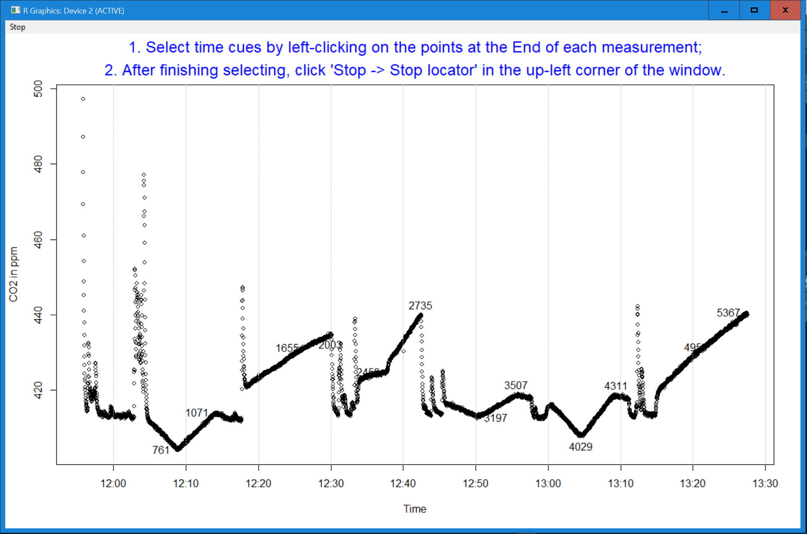
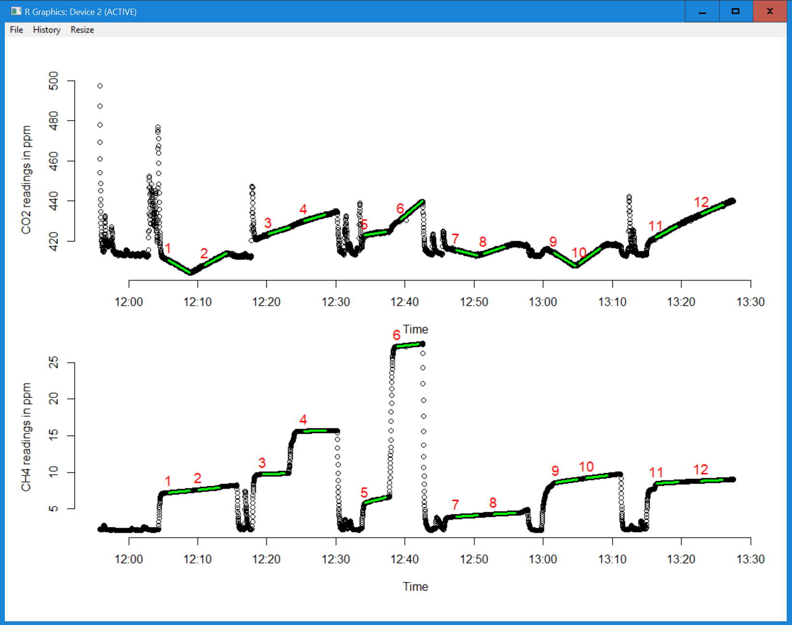

<!-- README.md is generated from README.Rmd. Please edit that file -->

```{r, include = FALSE}
knitr::opts_chunk$set(
  collapse = TRUE,
  comment = "#>",
  fig.path = "man/figures/README-",
  out.width = "100%"
)
```

# FluxCalR: a R package for calculating CO<sub>2</sub> and CH<sub>4</sub> fluxes from static chambers

<!-- badges: start -->
[](https://travis-ci.com/junbinzhao/FluxCalR)
[](https://joss.theoj.org/papers/2ed7dce0968c5ae0cf1d00c942502ff8)
<!-- badges: end -->

### Why is the package needed?

The static close chamber technique is a widely used approach for measuring greenhouse gas fluxes from different sources in an ecosystem (e.g. soil respiration). While the method itself is easy and cheap to implement, the calculation of fluxes from the measured gas concentrations includes many tedious processes. Previous programs that can calculate the fluxes measured using the static chamber method were either compatible to only one designated system (e.g., [Licor Trace Gas Analyzer Platform](https://www.licor.com/env/products/trace_gas/), [Flux Puppy](https://www.sciencedirect.com/science/article/pii/S0168192319301522)), unable to calculate fluxes for multiple gases (e.g., [Flux Puppy](https://www.sciencedirect.com/science/article/pii/S0168192319301522)), or hard to handle continuously measured concentrations (e.g., R package ['flux'](https://cran.r-project.org/web/packages/flux/index.html)). 

### About the package

This R package `FluxCalR` is designed to calculate CO<sub>2</sub> and CH<sub>4</sub> gas fluxes measured with static chamber method. It provides an easy way to calculate multiple flux measurements from one continuously measured data file exported by most gas analyzers (e.g. LGR Ultraportable Gas Analyzers). Specifically, users can use the function `LoadLGR()` or `LoadOther()` to load the raw data file that includes the gas concentration records. Then, create a separate data frame by `SelCue()` that includes the time cues that each measurement starts and/or ends corresponding to the time in the raw data file. Based on the time cues, the fluxes of all the measurements can be calculated and exported using the function `FluxCal()`. In addition, the package has several features that facilitate the process of flux calculation:

* **An interactive way of selecting the measurement time cues** - The package includes the function `SelCue()` that one can use to select the time cues (start or end of each measurement) manually by clicking on an interactive graph of the entire gas concentration time series from the raw data file. The data frame returned from the function can be directly used as the argument `df_cue` in the function `FluxCal()` for the flux calculation. The time cue data frame can also be saved (default) and used again to get reproducible results.   

* **Flexible input** - Depending on the measurement protocol and requirement of the users, the `FluxCal()` function is flexible in the sense that 1) it takes either "Start", "End" or both "Start_End" of each measurement (argument `cue_type`) as time cues to identify each measurement; 2) it calculates "CO2", "CH4" or both "CO2_CH4" fluxes at the same time (argument `cal`); 3) the temperature used for calculation can be either measured by the analyzer (default), measured by a separate sensor, or a constant number defined by the user. 

* **A dynamic measurement window** - The flux calculation automatically scans through a range of 1.5x (default) of the measurement window and the best linear regression (largest R<sup>2</sup>) is used to calculate the final fluxes. This protocol optimize the representativeness and reproducibility of the calculated flux. This dynamic range can be changed in the argument `ext` in the function `FluxCal()`. 

* **A checkup graph after the calculation** - By default (argument `check_plot`), a graph is plotted after the calculation with regression lines plotted on the CO<sub>2</sub> and/or CH<sub>4</sub> concentration time series for checkup purposes. This post-calculation feature will help users identify any flux calculation that is based on the unwanted section of the data. 

* **Easy to be integrated into workflows** - The `FluxCal()` returns a data frame with the calculated flux and identifier of each measurement (e.g., plot ID, see argument `Other`) that can be integrated into users' data processing/analyzing workflow. At the same time, it also saves the data frame to a ".csv" file that can be loaded by R again later or futher processed in other programs. 

### Installation

First, make sure the package `remotes` is installed in R. If not, install the package by: 
```r
install.packages("remotes")
```
Then, install the `FluxCalR` package (with vignettes) in R by:
```r
remotes::install_github("junbinzhao/FluxCalR",build_vignettes = TRUE)
```
The functioning of the package is based on other R packages: `dplyr`, `lubridate`, `assertthat`, `magrittr` and they will/must be installed before using the functions in the `FluxCalR` package.

*Note: in case the installation fails in Rstudio, try to install the package in the original R program and then load the package in Rstudio.* 


### Community Guidelines

To report problems, seek support or contribute, please contact the author Junbin Zhao (junbinzhao1985@gmail.com). Requests/suggestions for new features are also welcome.


### Example

This is a basic example which shows how to calculate fluxes from raw data exported from the LGR Ultraportable Gas Analyzer with manually selected time cues.

First, we'll need to load the raw data file exported from LGR into the R program by the function `LoadLGR()`. The users just need to assign the directory (including the file name) and timestamp format. Then the function will take care the rest process and convert the data file into a data frame that can be used in the next steps. Here, we take the example data file "Flux_example_1_LGR.txt" comes with the package. 

```{r example 1}
library(FluxCalR)
#### data from LGR
# get the directory of the example LGR raw data
example_data1 <- system.file("extdata", "Flux_example_1_LGR.txt", package = "FluxCalR")
example_data1 # check the directory

# load the data
Flux_lgr <- LoadLGR(file = example_data1,
                    time_format = "mdy_HMS")
```

After loading the data, one can use the function `SelCue()` to manually identify the data for each of the measured fluxes within the entire dataset. After executing the function, a interactive graph of CO2 (or CH4, see the argument `flux`) concentration time series will pop up for the user to click on the corresponding points (either end or start of the measurements). Selecting the **End** (see the argument `cue`) points are recommended here because they are usually associated with sudden drops or increases in the gas concentrations when removing the chamber, making them easier to be identified than the starting points. 

```{r only show the code for selecting cues,eval=F}
# manually select the end of each measurement as time cues
time_cue <- SelCue(Flux_lgr,flux = "CO2",cue = "End",save = F)
```

```{r,echo=F,out.width = "700xp"}
 # add time cue graph with limited width
```

```{r secretely load time cues,echo = F}
time_cue <- read.csv("vignettes/Time_cue.csv")
```

This is how the "time_cue" data frame looks like. Instead of having it created by the function `SelCue()`, one can also manually prepare such a file and load it into R as a data frame. But the column name ("End" or "Start") and time format must be in line with the "time_cue" here, or see example files "Time & Ta_1.csv" and "Time & Ta_2.csv" at https://github.com/junbinzhao/FluxCalR/tree/master/inst/extdata).  

```{r}
time_cue
```

After having the time cues saved as a data frame 'time_cue', we can do the calculations now using the function `FluxCal()`! In the function, there are **5 arguments** that have to be assigned by the users without default: `data` (the data frame we got from `LoadLGR()`), `win` (the window size for flux calculation, unit: minute),`vol` (chamber volumn in l),`area` (chamber base area in m^2) and `df_cue` (the data frame we got from `SelCue()`). After the function is executed with the arguments assigned, the calculation will be done and a check-up graph with all the regression lines drawn on top of the gas concentration time series will pop up by default for the user to visually check if there is any mistake occured to the calcualtions. 

```{r calculate the flux without being evaluated, eval=F}
# calculate the fluxes over a 3-minute window using the manually selected cues
Flux_output1 <- FluxCal(data = Flux_lgr,
                        win = 3,
                        vol = 208,area = 0.26,
                        df_cue = time_cue,
                        cue_type = "End",
                        output = FALSE) # no output file
```

```{r,echo=F,out.width = "700xp"}
 # add output graph with limited width
```

```{r secretely calculate without showing the checkup plot,echo = F}
Flux_output1 <- FluxCal(data = Flux_lgr,
                        win = 3,
                        vol = 208,area = 0.26,
                        df_cue = time_cue,
                        cue_type = "End",
                        check_plot = FALSE,
                        output = FALSE) # no output file
```

This is how the output data frame looks like and the last column ("Flux") includes the calculated flux rates: 
```{r show the ouput data frame}
head(Flux_output1)
```

For more details of the functions and examples, please check the vignette (`browseVignettes("FluxCalR")`) and the help documents (`?LoadLGR()`,`?LoadOther()`,`?SelCue()`,`?FluxCal()`). 


### Please cite the package as:

Junbin Zhao (2018). FluxCalR: a R package for calculating CO<sub>2</sub> and CH<sub>4</sub> fluxes from static chambers. R package version 0.2.0. https://github.com/junbinzhao/FluxCalR/
